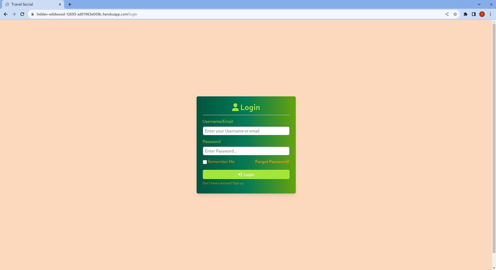

# Travel-Social

## About
Social Media App for travelers to share their grand adventures. The user can create a trip, add images, add comments, tag friends, update comments, etc.

## Table of Contents
  
  [About](#about)
  [User Story](#user-story)
  [Preview](#preview)
  [Installation](#installation)
  [Tests](#tests)
  [License](#license)

## User Story

AS A travel enthusiast and socially connected person,
I AM proud to share my travel experiences with my social media buddies and the world,
I WANT to share the joys, surprises, and exciting findings of my travels, 
AND read the interesting stories of other locations from my friends and social media buddies,
SO I can plan my next trip or suggest a location to any acquiescence

## Preview

The Travel Social website is available at [https://trasocial-004292627be8.herokuapp.com/](https://trasocial-004292627be8.herokuapp.com/).

The following images shows the HTML’s appearance and functionality:

 

 

 

 

 

  
## Installation
  No Installation Application is hosted
  For Developers of the platform to run an instance locally:
  - 1) Git Clone The Repo and Install all Dependent Node Modules
  - 2) Run The Schema in the DB directory folder
  - 3) Run node seeds/seed or npm seed to seed the Database
  - 4) Run node server or npm start to start the server

## Tests
  No Test Currently

## License
  Copyright <2023> <COPYRIGHT Isoyor Kubiti>

---
    Permission is hereby granted, free of charge, to any person obtaining a copy of this software and associated documentation files (the "Software"), to deal in the Software without restriction, including without limitation the rights to use, copy, modify, merge, publish, distribute, sublicense, and/or sell copies of the Software, and to permit persons to whom the Software is furnished to do so, subject to the following conditions:

    The above copyright notice and this permission notice shall be included in all copies or substantial portions of the Software.

    THE SOFTWARE IS PROVIDED "AS IS", WITHOUT WARRANTY OF ANY KIND, EXPRESS OR IMPLIED, INCLUDING BUT NOT LIMITED TO THE WARRANTIES OF MERCHANTABILITY, FITNESS FOR A PARTICULAR PURPOSE AND NONINFRINGEMENT. IN NO EVENT SHALL THE AUTHORS OR COPYRIGHT HOLDERS BE LIABLE FOR ANY CLAIM, DAMAGES OR OTHER LIABILITY, WHETHER IN AN ACTION OF CONTRACT, TORT OR OTHERWISE, ARISING FROM, OUT OF OR IN CONNECTION WITH THE SOFTWARE OR THE USE OR OTHER DEALINGS IN THE SOFTWARE.
---